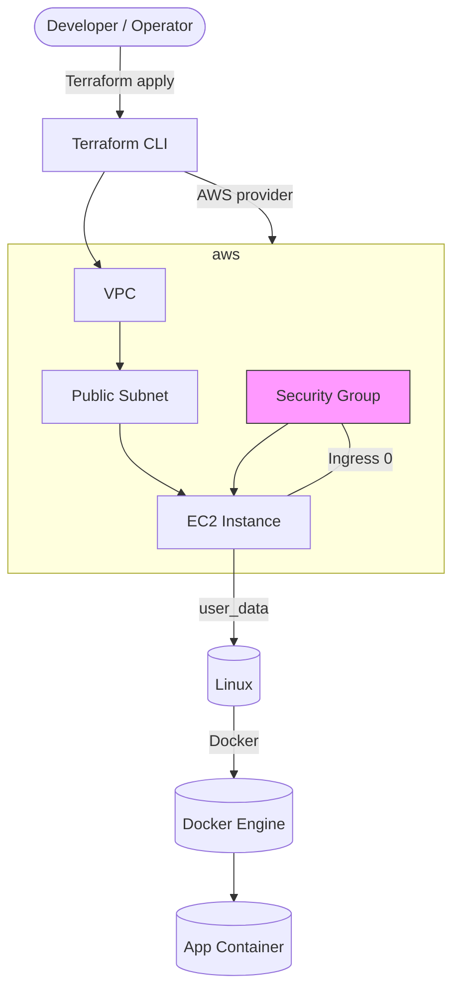
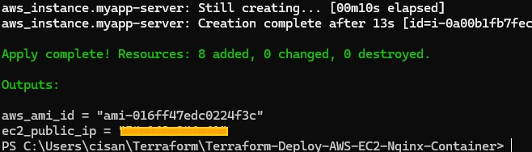
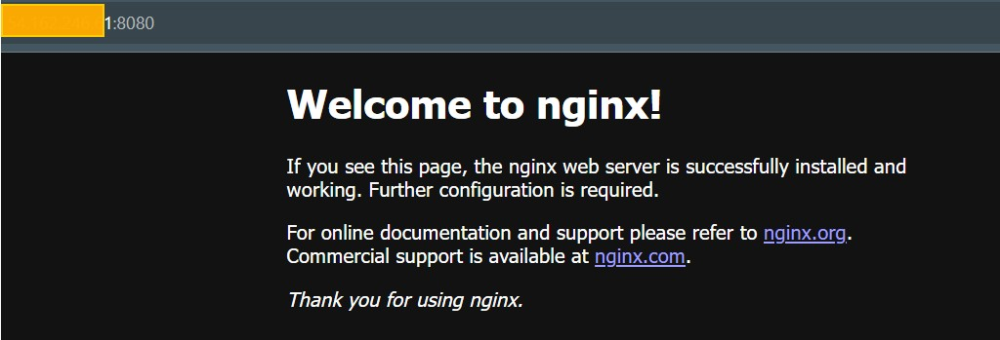
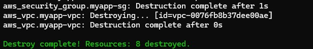
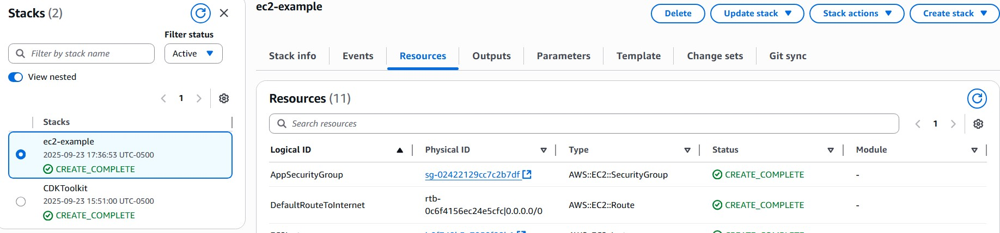
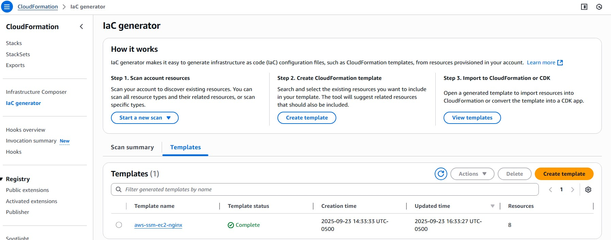
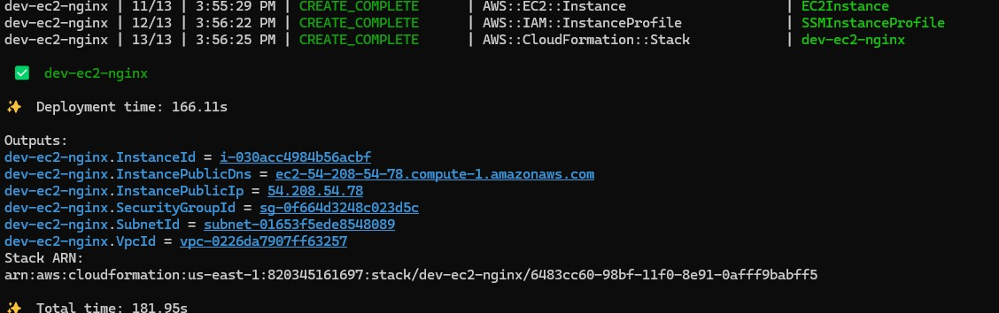

# Terraform: Deploy AWS EC2 with Nginx (Container)

This repository provisions an **AWS EC2 instance** inside a **VPC** and runs **Nginx in a Docker container** (via `user_data`), using **Terraform** as the Infrastructure as Code (IaC) tool.

## Architecture



### Highlights & Detected Configuration
- **AWS Region**: `us-east-1`
- **EC2 key_name**: `server-key`
- **Security Group Ingress**: ports 0

## Tech Stack
- Terraform
- AWS (EC2, VPC, Security Group)
- Cloud-init / user_data

## Repository Structure (key files)
- Terraform-Deploy-AWS-EC2-Nginx-Container-main/main.tf
- Terraform-Deploy-AWS-EC2-Nginx-Container-main/providers.tf
- Terraform-Deploy-AWS-EC2-Nginx-Container-main/terraform.tfvars.example (rename/update)

## How It Works (High-Level)
1. **Terraform AWS Provider** authenticates to your AWS account and applies resources.
2. **VPC & Networking**: Creates or references a VPC and public subnet(s) for the instance.
3. **Security Group**: Opens minimal inbound ports (commonly 22 for SSH and 80/443 for HTTP/S) to your source(s).
4. **EC2 Instance**: Launches an Amazon Linux/Ubuntu AMI (check variables) with an assigned key pair.
5. **User Data**: Installs Docker and starts an **Nginx container** to serve HTTP traffic.
6. (Optional) **CloudFormation / IaC Generator / CDK**: Compare Terraform vs AWS CloudFormation  (see yaml in `AWS CDK Example` folder).

## Prerequisites
- **Terraform** v1.x
- **AWS credentials** configured locally (`aws configure` or environment variables)
- An **AWS account** with permissions to create VPC/EC2/SG (and optional IAM/ALB/Route53)
- (Optional) Use SSM yaml config in **AWS CDK Example Folder** 

## Quick Start

```bash
# 1) Initialize providers and modules
terraform init

# 2) Review/Set variables (see *.tfvars or variables.tf)
terraform plan

# 3) Apply the infrastructure
terraform apply -auto-approve
```

- 

```bash
# 4) After apply, find the public IP (via output or AWS console)
#    Then test HTTP:
curl http://<ec2-public-ip>:8080 (or via browser)
```

- 

```bash
# 5) SSH if needed
ssh -i <your-private-key path> ec2-user@<ec2-public-ip>   # Amazon Linux
ssh -i ec2-user@<ec2-public-ip>     # if ssh keys path updated in .tfvars
```

> **Note:** Lock down your Security Group sources (avoid `0.0.0.0/0` where possible).

## Variables & Outputs
- **Variables** detected: 0
- **Outputs** detected: 2
- **Resources** detected: 8 (see type counts below)

### Resource Type Counts
- `aws_instance`: 1
- `aws_internet_gateway`: 1
- `aws_key_pair`: 1
- `aws_route_table`: 1
- `aws_route_table_association`: 1
- `aws_security_group`: 1
- `aws_subnet`: 1
- `aws_vpc`: 1

## Common Troubleshooting
- **SSH Permission Denied**: Ensure your key pair matches `key_name` and that you’re using the correct username (Amazon Linux: `ec2-user`). Check SG inbound rules for your IP updated in .tfvars.
- **Nginx not reachable**: Confirm port 80/443 is open and the instance has a public IP/EIP or is behind an ALB with a listener.
- **Docker/Nginx not running**: Re-check `user_data` script and cloud-init logs (`/var/log/cloud-init-output.log`).

## Cleaning Up
```bash
terraform destroy
```
- 


## Compare TF with AWS CloudFormation and CDK
**1. Deploy Cloudformation Stack**: `aws-ssm-ec2-nginx.yaml` file located in AWS CDK Example folder.

- 

**2. Create IaC with Generator**: Generate your own scan then select resources to create IaC template based on Terraform `main.tf` resources.
- 


**3. Deploy with CDK** yaml file located in AWS CDK Example folder. 
Prerequisites of bootstrapping your AWS Account. Review AWS CDK documentation.

  ```bash
  cdk migrate --stack-name dev-ec2-nginx --from-path ./aws-ssm-ec2-nginx.yaml --language typescript
  ```
- 


## Cleaning Up
**Remember to delete stack resources in CloudFormation**


## License
MIT (or GNU).

---
